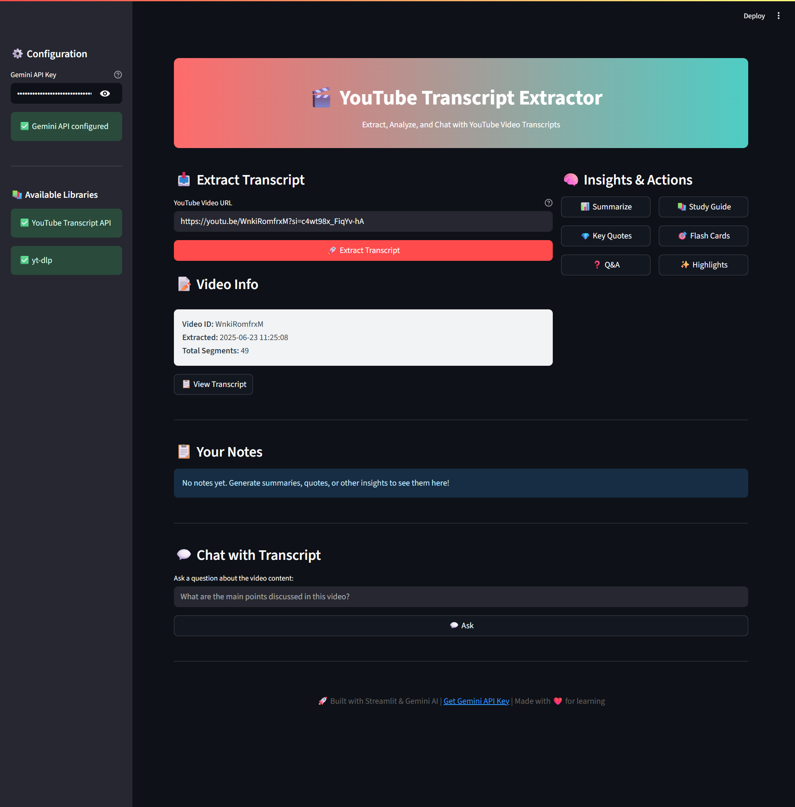

# 🎬 yt-transcript-gpt

  

yt-transcript-gpt is a Streamlit-based desktop/web app to extract YouTube video transcripts, enrich them with AI-powered analysis, and interact via chat—all in one place.

---

## ✨ What’s New

- 🎉 **Initial release** with core transcript extraction and AI modules  
- 🚀 Integrated both YouTube Transcript API and `yt-dlp` fallback  
- 🤖 Gemini AI features: summaries, key quotes, Q&A, study guides, flashcards, insights  
- 🔍 Interactive transcript viewer with search, copy, and notes  
- 💬 Chat interface to ask questions about the transcript  

---

## 🛠️ All Features

- **Transcript Extraction** via YouTube Transcript API or `yt-dlp`  
- **AI Analysis** through Google Gemini:  
  - Summaries  
  - Key Quotes  
  - Q&A sessions  
  - Study Guides  
  - Flashcards  
  - Highlighted Insights  
- **Interactive Viewer**: search, scrollable transcript, per-paragraph copy & notes  
- **Downloadable Content**: transcripts and AI-generated outputs (Markdown/plain text)  
- **Chat Mode**: ask questions about video content and get AI answers  
- **Configurable**: enable/disable libraries, set Gemini API key  

---

## 🗂️ Folder Structure

```
yt-transcript-gpt/
├── .gitignore                   # Git ignore file
├── CODE_OF_CONDUCT.md           # Code of Conduct
├── CONTRIBUTING.md              # Contribution guidelines
├── LICENSE                      # MIT License
├── README.md                    # This file
├── requirements.txt             # Python dependencies
├── src/                         # Source code
│   ├── main.py                  # Streamlit app entry point
│   └── app/                     # Main application package
│       ├── __init__.py          # Makes 'app' a Python package
│       ├── gemini_ai.py         # Gemini AI integration
│       ├── main.py              # Core application logic
│       ├── transcript_extractor.py # Transcript extraction logic
│       ├── ui.py                # UI components and layout
│       └── utils.py             # Utility functions
├── tests/                       # Test suite
│   ├── test_gemini_ai.py        # Tests for Gemini AI module
│   └── test_transcript_extractor.py # Tests for transcript extractor
└── screenshots/                 # UI previews
    └── screenshot.png
```

---

## 📋 Requirements

- **Python 3.8+**  
- **pip** package manager  
- **Streamlit**  
- **youtube-transcript-api** (optional)  
- **yt-dlp** (optional)  
- **google-generativeai** for Gemini features  

Install dependencies:

```bash
pip install -r requirements.txt
````

If no `requirements.txt`, run:

```bash
pip install streamlit youtube-transcript-api yt-dlp google-generativeai
```

---

## ⚙️ Installation

1. **Clone** the repo

   ```bash
   git clone https://github.com/ukr-projects/yt-transcript-gpt.git
   cd yt-transcript-gpt
   ```
2. **Install** dependencies

   ```bash
   pip install -r requirements.txt
   ```

---

## ▶️ Usage

1. **Run** the app

   ```bash
   streamlit run src/main.py
   ```
2. **Configure** in the sidebar:

   * Paste your **Gemini API Key** to enable AI features
   * See status of transcript libraries (`youtube-transcript-api`, `yt-dlp`)
3. **Extract Transcript**:

   * Enter a YouTube video URL
   * Click **🚀 Extract Transcript**
4. **View & Interact**:

   * Search within the transcript
   * Copy paragraphs or add notes
   * Download the raw transcript
5. **AI Insights**:

   * Use buttons to generate summaries, quotes, Q\&A, study guides, flashcards, highlights
6. **Chat**:

   * Ask questions about the transcript content and view AI answers

---

## 📸 Screenshot



---

## 🤝 How to Contribute

1. **Fork** this repository
2. **Create** a branch:

   ```bash
   git checkout -b feature/YourFeature
   ```
3. **Implement** and **Commit** your changes
4. **Push** and **Open** a Pull Request

---

## 🙏 Acknowledgments

* **Streamlit** for rapid GUI development
* **YouTube Transcript API** & **yt-dlp** for transcript extraction
* **Google Gemini AI** (`google-generativeai`) for advanced analysis

## 🌟 Star History

If you find this project useful, please consider giving it a star on GitHub! Your support helps us continue improving and maintaining this tool.

## 📞 Support

- **GitHub Issues**: [Report bugs or request features](https://github.com/ukr-projects/yt-transcript-gpt/issues)
- **Discussions**: [Community discussions and Q&A](https://github.com/ukr-projects/yt-transcript-gpt/discussions)
- **Email**: ukrpurojekuto@gmail.com

---

<div align="center">

**Made with ❤️ by the Ujjwal Nova**

[⭐ Star this repo](https://github.com/ukr-projects/yt-transcript-gpt) | [🐛 Report Bug](https://github.com/ukr-projects/yt-transcript-gpt/issues) | [💡 Request Feature](https://github.com/ukr-projects/yt-transcript-gpt/issues)

</div>
