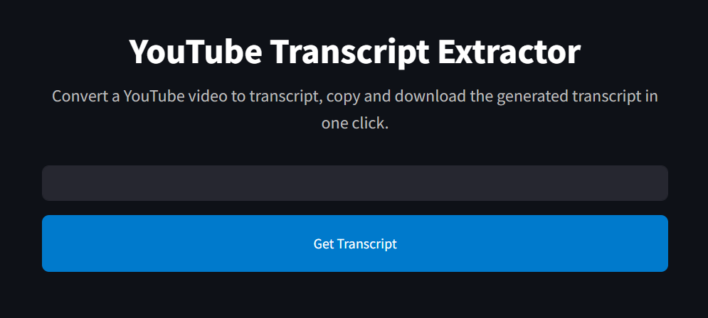

# YouTube Transcript Extractor

This is a Streamlit application that extracts transcripts from YouTube videos using the [youtube_transcript_api](https://github.com/jdepoix/youtube-transcript-api). The app supports both manually generated and auto-generated transcripts and allows users to select their preferred language for the transcript. An embedded YouTube player displays the video alongside the transcript.

## Features

- **Video ID Extraction:** Recognizes multiple YouTube URL formats and extracts the video ID.
- **Transcript Retrieval:** Fetches the transcript using the YouTube Transcript API.
- **Language Selection:** Lists available transcript languages for selection.
- **Embedded Video Playback:** Displays the YouTube video in an embedded player.
- **Custom Styling:** Provides a clean and modern interface with custom CSS styling.

## Screenshots
<p align="center">
  
</p>

## Installation

Follow these steps to run the application locally:

1. **Clone the repository:**

   ```bash
   git clone https://github.com/UKR-PROJECTS/Streamlit-SSTranscript.git
   cd Streamlit-SSTranscript
   ```

2. **(Optional) Create and activate a virtual environment:**

   ```bash
   python -m venv venv
   source venv/bin/activate  # On Windows use `venv\Scripts\activate`
   ```

3. **Install the dependencies:**

   ```bash
   pip install -r requirements.txt
   ```

## Running the App

Launch the application using Streamlit by running:

```bash
streamlit run app.py
```

The app should automatically open in your default web browser. If not, navigate to the provided local URL (usually `http://localhost:8501`).

## File Structure

- **app.py**: Main Streamlit application script containing the application logic.
- **requirements.txt**: Lists project dependencies (e.g., `streamlit` and `youtube_transcript_api`).
- **README.md**: Documentation file (this file).
- **.gitignore**: Specifies intentionally untracked files to ignore (such as virtual environment folders, cache, etc.).

## Dependencies

The project requires the following Python packages:

- [streamlit](https://www.streamlit.io/)
- [youtube_transcript_api](https://github.com/jdepoix/youtube-transcript-api)

You can install them using:

```bash
pip install streamlit youtube_transcript_api
```

Or by running:

```bash
pip install -r requirements.txt
```

## Contributing

Contributions are welcome! If you find any issues or have suggestions for improvements, please open an issue or submit a pull request.

## License

This project is licensed under the MIT License. See the [LICENSE](LICENSE) file for details.

## Acknowledgements

- [Streamlit](https://streamlit.io/) for the web application framework.
- [youtube_transcript_api](https://github.com/jdepoix/youtube-transcript-api) for transcript retrieval functionality.
- Thanks to the contributors and the open-source community for their continued support.
