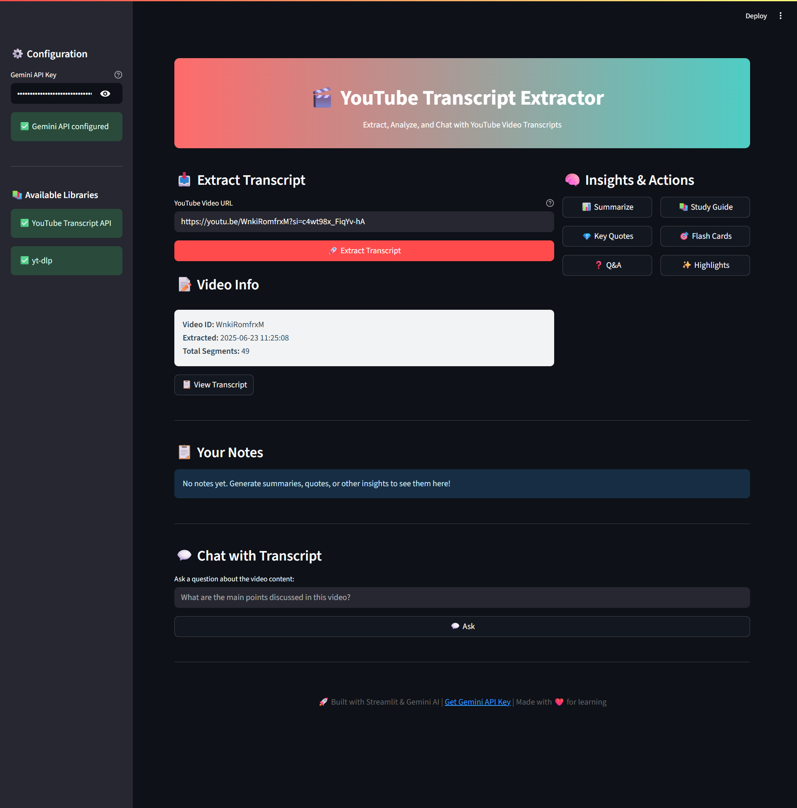

# 🎬 yt-transcript-gpt

[](LICENSE)
[](STATUS.md)
[](CHANGELOG.md)


<div align="center">
  
</div>

<div align="center">
  
</div>

---

## 🖼 Screenshot

<div align="center">
  
  <p><em>Web UI</em></p>
</div>


---

## ✨ What’s New in v1.0.0

- 🎉 **Initial release** with core transcript extraction and AI modules  
- 🚀 Integrated both YouTube Transcript API and `yt-dlp` fallback  
- 🤖 Gemini AI features: summaries, key quotes, Q&A, study guides, flashcards, insights  
- 🔍 Interactive transcript viewer with search, copy, and notes  
- 💬 Chat interface to ask questions about the transcript  

---

## 🛠️ All Features

- **Transcript Extraction** via YouTube Transcript API or `yt-dlp`  
- **AI Analysis** through Google Gemini:  
  - Summaries  
  - Key Quotes  
  - Q&A sessions  
  - Study Guides  
  - Flashcards  
  - Highlighted Insights  
- **Interactive Viewer**: search, scrollable transcript, per-paragraph copy & notes  
- **Downloadable Content**: transcripts and AI-generated outputs (Markdown/plain text)  
- **Chat Mode**: ask questions about video content and get AI answers  
- **Configurable**: enable/disable libraries, set Gemini API key  

---

## 🗂️ Folder Structure

```
yt-transcript-gpt/
├── .devcontainer/
│   └── devcontainer.json
├── .github/
│   ├── ISSUE_TEMPLATE/
│   │   ├── bug_report.md
│   │   └── feature_request.md
│   ├── PULL_REQUEST_TEMPLATE.md
│   ├── RELEASE_TEMPLATE.md
│   └── workflows/
│       └── ci.yml
├── .gitignore
├── assets/
│   ├── screenshots/
│   │   └── screenshot.png
│   └── yt-transcript-gpt-banner.jpg
├── docs/
│   ├── CHANGELOG.md
│   ├── CODE_OF_CONDUCT.md
│   ├── CONTRIBUTING.md
│   ├── README.md
│   ├── SECURITY.md
│   ├── STATUS.md
│   └── USAGE.md
├── LICENSE
├── pyproject.toml
├── requirements.txt
├── src/
│   ├── app/
│   │   ├── __init__.py
│   │   ├── gemini_ai.py
│   │   ├── main.py
│   │   ├── transcript_extractor.py
│   │   ├── ui.py
│   │   └── utils.py
│   └── main.py
└── tests/
    ├── test_gemini_ai.py
    └── test_transcript_extractor.py

```

---

## 🕹 Usage

### Prerequisites

- GitHub

### Installation

```bash
# Clone the repository
git clone https://github.com/nova-cortex/yt-transcript-gpt.git
```

For more detailed documentation, see our [USAGE.md](USAGE.md)

---

## 🤝 Contributing

Please see our [Contributing Guide](CONTRIBUTING.md) for details.

---

### Code of Conduct

This project follows our [Code of Conduct](CODE_OF_CONDUCT.md). Please read it before contributing.

---

## 📋 Roadmap

- [x] Chat interface
- [x] Gemini AI features
- [x] Integrated both YouTube Transcript API and `yt-dlp` fallback

See the [open issues](https://github.com/nova-cortex/yt-transcript-gpt/issues) for a full list of proposed features and known issues.

---

## 📝 Changelog

All notable changes to this project are documented in [CHANGELOG.md](CHANGELOG.md).

---

## 📄 License

This project is licensed under the MIT License - see the [LICENSE](../LICENSE) file for details.

---

## 🙏 Acknowledgments

* **Streamlit** for rapid GUI development
* **YouTube Transcript API** & **yt-dlp** for transcript extraction
* **Google Gemini AI** (`google-generativeai`) for advanced analysis

---

## 📞 Support

- 📧 Email: ujjwalkrai@gmail.com
- 🐛 Issues: [Repo Issues](https://github.com/nova-cortex/yt-transcript-gpt/issues)
- 🔓 Security: [Repo Security](https://github.com/nova-cortex/yt-transcript-gpt/security)
- ⛏ Pull Request: [Repo Pull Request](https://github.com/nova-cortex/yt-transcript-gpt/pulls)
- 📖 Docs: [Repo Documentation](https://github.com/nova-cortex/yt-transcript-gpt/tree/main/docs)
- 📃 Changelog: [Repo Changelog](https://github.com/nova-cortex/yt-transcript-gpt/docs/CHANGELOG.md)
---

## 🔗 Connect

#### 📝 Writing & Blogging
[](https://ukr-projects.hashnode.dev/)
[](https://medium.com/@ukrpurojekuto)

#### 💼 Professional
[](https://ukr-projects.github.io/ukr-projects/)
[](https://github.com/ukr-projects)
[](https://github.com/cyberx-projects)
[](https://github.com/contro-projects)
[](https://www.linkedin.com/in/u-k-r/ )
[](https://www.youtube.com/@ujjwal-krai)

#### 🌐 Social
[](https://x.com/ukr_projects)
[](https://www.instagram.com/ukr_projects)
[](https://www.youtube.com/@ukr-projects)
[](https://t.me/ukr_projects)
[](https://www.reddit.com/user/mrujjwalkr)

---

<div align="center">
  Made with ❤️ by <a href="https://github.com/ukr-projects">ukr</a>
</div>

---
